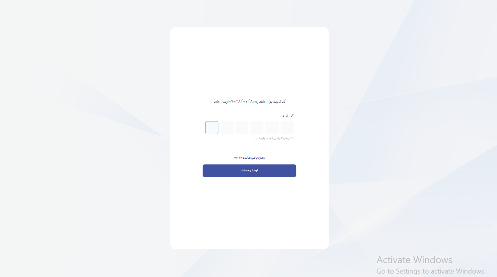
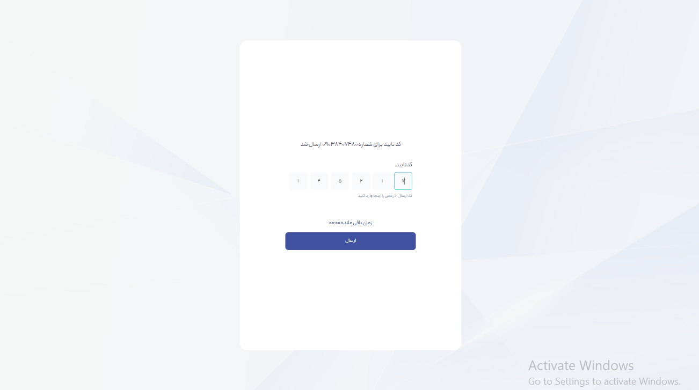
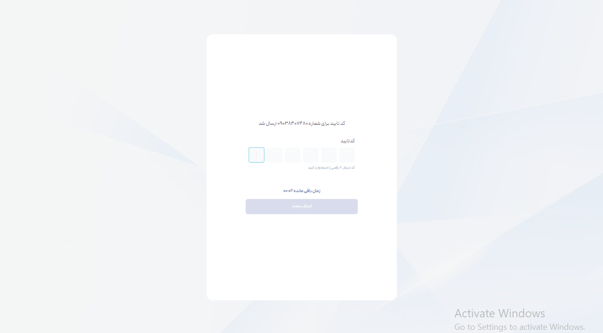

# OTP Code Form Project

## 🚀 Project Overview

This project is a Vue 3 application that features a One-Time Password (OTP) code form. The form includes a countdown timer that resets if the OTP code is not entered in time. The timer's state is managed using Pinia, and the UI is styled with Sass.
## 🌐 Live Demo

Check out the live demo of the project [here](https://otp-form-teal.vercel.app).

## 🛠️ Technologies Used

- **Vue 3**: Leveraging the Composition API for a modern, flexible, and efficient approach to building components.
- **Pinia**: State management for the timer, allowing seamless global state access across components.
- **Sass**: CSS preprocessor used for writing more maintainable and scalable styles.
- **Vite**: For fast build and development server.

## 🎯 Features

- **OTP Form**: A form to enter a six-digit OTP code.
- **Timer**: A countdown timer that automatically resets if the code is not submitted within the time limit.
- **State Management**: Timer state is globally managed using Pinia, providing reactive and shareable state across components.

## 📂 Project Structure

```bash
├── public/
├── src/
│   ├── assets/          # fonts ,icons and images sources
│   ├── components/      # Vue components
│   ├── pages/           # Vue pages
│   ├── stores/          # Pinia stores
│   ├── styles/          # sass styles
│   ├── App.vue          # Main App component
│   ├── main.js          # Entry point
├── .gitignore
├── package.json
├── README.md            # You're reading this now!
└── vite.config.js       # Vite configuration
```

## Clone the repository:

```sh
git clone https://github.com/yourusername/otp-code-form.git
cd otp-code-form
```

## Install dependencies:

```sh
npm install

```

## Run the development server:

```sh
npm run dev

```

## Build for production:

```sh
npm run build

```
## 📸 Screenshots

Here’s what the OTP form looks like:






